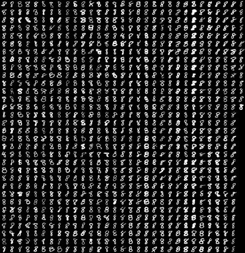
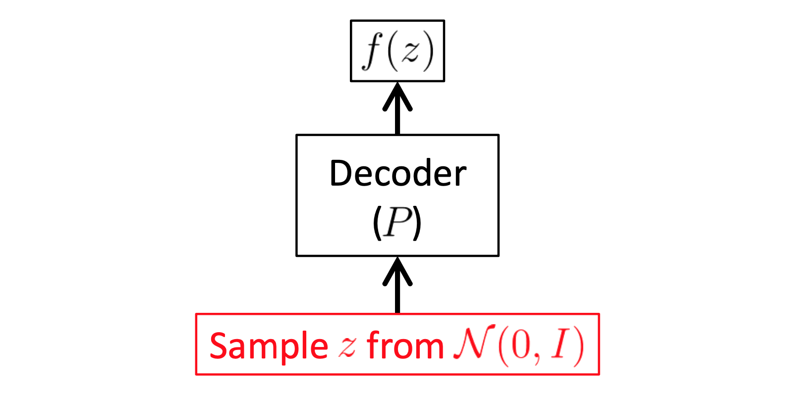

> 这篇文章是个人对 [Tutorial on Variational Autoencoders. **arXiv(2016)**](https://arxiv.org/abs/1606.05908v2) 的梳理。

### 0. 生成式模型（Generative Models）

生成式模型是概率统计和机器学习中一个很重要的概念，即我们对一个未知分布进行取样以后，一个模型能够在观测这些样本后习得某种合理的规律，并且随机生成未观测过的样本，（尤其是在给定某些隐含参数的条件下）。

以MNIST数据集为例，假设我们有一部分手写数字和字母的图片作为训练数据集，我们想要训练出一个模型能够通过“观测”这些图片以后，生成符合手写规律（内容能被清晰的识别）但是又没有在训练数据集上出现过的样本，这样的模型就是生成式模型。



<center>图1. MNIST数据集样例</center>
规范一些来说，假设我们有一部分来自于未知分布$P_{gt}(X)$的样本$X$，我们的目标为习得一个模型$P$，我们能从中取样并且与$P_{gt}(X)$尽可能的相似。


然而，目前训练这种模型的方法主要面临着这三个严重问题：

1. 可能需要对样本数据的结构的一些比较强的假设（即样本数据遵循的一些规则）
2. 可能逼近的不够好，最终只能获得次优解
3. 可能依赖于代价比较昂贵的一些推断步骤，如马尔科夫链蒙特卡洛方法(*Markov Chain Monte Carlo*)。


**相对的，VAE *(Variational Autoencoders)* 的优势在于，不需要对样本有比较强的假设，并且能够通过反向传播来快速训练。**


### 1. 什么是VAE（What is VAE）

**VAE的主要思想是，假设一个生成式模型是建立在一些“潜在变量”（Latent Variables，或称隐变量）的基础上的，通过调整这些“潜在变量”，模型就可以生成不同的样本。**

#### 1.1 什么是潜在变量（Latent Variables）


<center>图2. 猫与狗</center>
以生成猫的图片为例，我们无法显式的声明一张猫的图片应该符合哪些约束条件，例如“两只眼睛”，“毛茸茸”等这些约束条件即使满足也不能确定模型生成的图片中就是一只猫，也许会是一只狗，或者什么也不像。

但是我们知道（或者说可以合理的假设），一个好的模型一定在生成每个像素之前就做了某种“决策”，或者说这些生成的内容是在某些“变量”的管控之下完成的，否则，图片一部分是猫一部分是其它内容，就会导致生成无意义的内容。

这些能够影响生成过程的“变量”，我们就称之为“潜在变量”。


#### 1.2 基于潜在变量的VAE的规范定义

首先，基于“最大似然”假设：一个更有可能生成训练集上的样本的模型，同时也更有可能生成与训练样本相似的样本，也更不可能生成完全不一样的样本。

从概率分布的角度：

1. 假设我们用输出分布（模型） P 来逼近所有样本 X 所处的真实的分布，**我们的目标就是最大化训练集中每个样本 X 在分布 P 上的概率 P(X)。**

2. **引入模型参数和潜在变量**：假设模型 P 本身的参数为来自参数空间 $\Theta$ 的向量 $\theta$，并在某个高维度空间 Z 上的一个潜在变量向量 z 的管控下生成样本，我们希望通过在 Z 上对 z 的不同取样来驱使模型生成不同的样本，由此，可以将 P(X) 进一步表示为：
$$
P(X) = \int P(X|z;\theta)P(z)dz. \tag{1}
$$

对于 VAE 来说，通常选择高斯分布来作为输出分布，即：$P(X|z;\theta) = N(X|f(z;\theta), \sigma^2 * I)$，即均值为 $f(z;\theta)$，协方差等于单位矩阵 $I$ 乘以一个超参  $\sigma$。当然，不一定非得选择高斯分布，但所选的分布需要具有可计算并连续的性质。

**由于 VAE 引入了潜在变量，因此，VAE 所要解决的问题即为**：

1. 如何定义潜在变量
2. 如何计算潜在变量的积分以实现反向传播

接下来，通过 VAE 背后的数学原理来一步步推导 VAE 所涉及的公式并且更好的理解 VAE。

### 2. VAE背后的数学原理（The Mathimatics behind VAE）

#### 2.1 如何定义潜在变量
VAE 认为潜在变量的每个维度的含义是无法解释的，并且也应该避免去手动定义每个维度所表示的意义，但是，VAE 假设潜在变量可以从一个简单的正态分布 N(0, I) 中取样得来，其中 I 是一个单位矩阵。

这是为什么呢？潜在变量为什么一定服从正态分布呢？

这涉及一个定理，即任何一个 d 维的分布都可以通过一个足够复杂的函数将一组符合正态分布的 d 个向量映射来得到。


<center>图3. 给定一个随机变量 z，我们可以生成另一个服从一个完全不同分布的随机变量 X = g(z)</center>
如图3所示，左边为从高斯分布中采样得到的一些变量。我们想要构造一个环形分布，就可以如图3右边所示，将这些变量通过函数 $g(z) = z/10 + z/||z||$ 映射以形成一个环。这就是 VAE 用来创建任意分布的策略，而这个确定性函数 g 是我们从数据中习得的。

由此，给定一个足够强大的函数逼近器，我们可以习得一个函数将我们的独立的、正态分布的 z 值映射为任意的模型所需的潜在变量，并借由这些潜在变量生成 X。

#### 2.2 如何计算潜在变量的积分
接下来，我们所要做的就是在 $P(z) = N(0, I)$ 的条件下最大化公式（1）。机器学习中通常的做法即为，找到一个包含 P(X) 的可计算公式，只要我们能计算这个公式的梯度，我们就能优化我们的模型。

一个较为直接的计算 P(X) 的近似值的方法为：首先取样大量的 z 值 ${z_1, ..., z_n}$，然后计算 $P(X) \approx \frac{1}{n} \sum_i P(X|z_i)$。

##### 2.2.1 引入函数 $Q(z|X)$
然而，问题是，这个方法在高维空间下，我们采样的数量得非常大才行。另一方面，对于采样的绝大多数的 z 值，$P(X|z)$ 几乎为0，这些 z 值对于我们的计算毫无意义。

基于此，VAE 试图只采样那些有可能导致生成 X 的 z 值，这就意味着，**我们需要一个新的函数 Q(z|X)，能够在给定 X 的情况下输出那些有可能产生 X 的 z 值分布。**

引入这个函数以后，新的问题也来了，如何保证我们从 Q(z|X) 采样的 z 值是服从正态分布的呢？

##### 2.2.2 关联 Q 与P
引入 Q(z|X) 以后，我们对于 P(X) 的逼近计算可表示为 $E_{z ~ Q}P(X|z)$。

现在，引入一个概念：KL散度（用 D 表示）。KL散度是用来计算两个分布之间的相似程度:

给定两个概率分布 q，和p，我们通过计算两者每个取值对应对数的差值的期望来衡量两个分布之间的相似度：
$$
D(p||q) = \sum_{i=1}^{N}p(x_i) * (log p(x_i) - log q(x_i)) \tag{2}
$$

施加在 Q(z|X) 和 P(z|X) 上，我们得到：
$$
D[Q(z|X) || P(z|X)] = E_{z ~ Q}[log Q(z|X) - log P(z|X)]. \tag{3}
$$

对 P(z|X) 施加贝叶斯公式以引入 P(X)，得：
$$
D[Q(z|X) || P(z|X)] = E_{z ~ Q}[log Q(z|X) - log P(X|z) - log P(z))] + log P(X). \tag{4}
$$
*注：在这里 log P(X) 与 z 值独立，因此可从期望中提取出来。*

整理一下，得到：
$$
log P(X) - D[Q(z|X) || P(z|X)] = E_{z ~ Q}[log P(X|z)]  - D[Q(z|X) || P(z)]. \tag{5}
$$

这个公式5就是 VAE 的核心。
* 公式左边：我们会在训练时不断最大化 log P(X)，同时，随着 Q 逐渐逼近 P，左边第二项 $D[Q(z|X) || P(z|X)]$会逐渐趋为0。我们无法直接分析计算 P(z|X)，但是当 Q 训练的足够好，即误差项 D 为 0，Q(z|X) 就可以用来表示 P(X|z)，且此时左边只剩下 $log P(X)$，使得我们能够直接优化 P(X)。

* 公式右边：这边是我们会实际上用梯度下降来进行优化的部分，可将 Q 看作是将 X 编码为 潜在变量 z 的编码器，而 P 是将其解码以重建 X的解码器。

##### 2.2.3 如何优化
首先，我们需要确定 Q(z|X) 的具体形式，通常我们选择 $Q(z|X) = N(z|u(X;\vartheta), \sum(X;\vartheta))$，其中 $\vartheta$ 表示从数据中习得的函数 $u$ 和 $\sum$ 的参数，实践中，我们通常约束 $\sum$ 为一个对角矩阵以简化公式5右边的计算。
这样，公式4右边的KL散度计算过程可表示为：
$$
D[N(u(X), \sum(X)) || N(0, I)] = \frac{1}{2}(tr(\sum(X)) + u(X))^T (u(X)) - k - log det(\sum(X)). \tag{6}
$$
其中，tr 表示矩阵的迹（对角元素之和）。

此外，在实践中，取样大量的 z 值来获取 $E_{z ~ Q}P(X|z)$ 的近似值的代价是很昂贵的，我们通常会只取一个 z 值并用对应的 P(X|z) 来代表 $E_{z ~ Q}P(X|z)$ 的近似值。

这样，我们就能在训练集 D 的所有样本 X 上进行梯度下降优化来。完整的需要优化的公式为：
$$
E_{X~D}[log P(X) - D[Q(z|X) || P(z|X)]] = E_{X~D}[E_{z ~ Q}[log P(X|z)]  - D[Q(z|X) || P(z)]]. \tag{7}
$$


<center> 图4. 重新参数化技巧（Reparameterization trick） </center>
但是我们在训练时，从 Q 中采样 z 有个问题，如图4左边所示，梯度下降算法可以处理随机的输入，但是没法处理采样这种随机的操作，因此会导致模型无法将误差反向传播到编码器。解决的办法称之为重新参数化技巧（Reparameterization trick），即将采样过程挪到模型的输入层，如图4的右边所示：我们可以在给定 u(X) 和 $\sum(X)$ （Q(z|X)的均值和协方差）的条件下，先从一个正态分布 N(1, I) 中采样得到 $\epsilon$，然后通过公式 $z = u(X) + \sum^{1/2}(X) * \epsilon$ 得到等效的 z 值。

需要注意的是，这个技巧仅在评估损失的函数是连续的情况下才有效，否则无法传播。

##### 2.2.4 VAE 的测试过程
测试过程不需要 decoder，我们只需要从正态分布中采样一个 z 值作为 decoder 的输入来获取生成结果。
一个测试过程的VAE如图5所示。

<center> 图5. 测试期的 VAE </center>
### 3. 什么是 CVAE （Conditional Variational Autoencoders）


<center> 图6. CVAE </center>
图6中，左边是训练期的 CVAE 结构，右边是测试期示意图。

以 MINIST 数据集为例，VAE 是通过一个潜在变量向量 z 来生成一张手写字符图像，但如果我们有一个不完整的手写字符图像，我们想通过 VAE 将其补充完整呢？

这个问题就引入了CVAE（Conditional Variational Autoencoders）。

规范定义：
给定一个输入 X 和一个输出 Y，我们想创建一个模型 P(Y|X) 能够最大化 Groud Truth 的概率。引入一个潜在变量，我们可以将模型 P 如此定义：
$$
P(Y|X) = N(f(z, X), \sigma ^2 * I). \tag{8}
$$
由此，我们可以将核心公式5重写为:

$$
log P(Y|X) - D[Q(z|Y, X) || P(z|Y, X)] = E_{z ~ Q(\dot|Y, X)}[log P(Y|z, X)]  - D[Q(z|Y, X) || P(z|X)]. \tag{9}
$$


### 4. 使用PyTorch实现一个简单的VAE （Vanilla VAE in PyTorch）
```python
import torch
import torch.nn as nn
import torch.optim as optim
import torch.nn.functional as F

import torchvision
from torchvision import transforms

import matplotlib.pyplot as plt

class Encoder(nn.Module):
    """
    Q(z|X)
    """
    def __init__(self, dim_in, dim_hidden, dim_out):
        super(Encoder, self).__init__()
        self.linear1 = nn.Linear(dim_in, dim_hidden)
        self.linear2 = nn.Linear(dim_hidden, dim_out)

    def forward(self, x):
        x = F.relu(self.linear1(x))
        latent = F.relu(self.linear2(x))
        return latent


class Decoder(nn.Module):
    """
    P(X|z)
    """
    def __init__(self, dim_in, dim_hidden, dim_out):
        super(Decoder, self).__init__()
        self.linear1 = nn.Linear(dim_in, dim_hidden)
        self.linear2 = nn.Linear(dim_hidden, dim_out)

    def forward(self, latent):
        temp = F.relu(self.linear1(latent))
        out = F.relu(self.linear2(temp))
        return out


class VAE(nn.Module):
    
    def __init__(self, encoder, decoder, latent_dim):
        super(VAE, self).__init__()
        self.encoder = encoder
        self.decoder = decoder
        self.latent_dim = latent_dim
        self.enc_mu = nn.Linear(100, self.latent_dim)
        self.enc_log_sigma = nn.Linear(100, self.latent_dim)

    def _sample_z(self, enc_hidden):
        """
        return the sampled z values from normal distribution: z ~ N(mu, sigma^2)
        """
        mu = self.enc_mu(enc_hidden)
        log_sigma = self.enc_log_sigma(enc_hidden)
        sigma = torch.exp(log_sigma)
        std_z = torch.randn(sigma.size()).float()

        self.z_mean = mu
        self.z_sigma = sigma

        return mu + sigma * std_z # reparameterization trick

    def _compute_latent_loss(self):
        mean_sq = self.z_mean * self.z_mean
        stddev_sq = self.z_sigma * self.z_sigma
        return 0.5 * torch.mean(mean_sq + stddev_sq - torch.log(stddev_sq) - 1)


    def forward(self, state):
        enc_hidden = self.encoder(state)
        z = self._sample_z(enc_hidden)
        return self.decoder(z)


if __name__ == '__main__':
    input_dim = 28 * 28
    batch_size = 32

    transform = transforms.Compose([transforms.ToTensor()])
    mnist = torchvision.datasets.MNIST('./', download=True, transform=transform)
    dataloader = torch.utils.data.DataLoader(mnist, batch_size=batch_size, shuffle=True)
    print('Number of samples: {}'.format(len(mnist)))

    encoder = Encoder(input_dim, 100, 100)
    decoder = Decoder(8, 100, input_dim)
    vae = VAE(encoder, decoder, 8)

    criterion = nn.MSELoss()

    optimizer = optim.Adam(vae.parameters(), lr=0.0001)

    for epoch in range(100):
        for i, data in enumerate(dataloader, 0):
            inputs, labels = data
            inputs.resize_(batch_size, input_dim)
            optimizer.zero_grad()
            out = vae(inputs)
            ll = vae._compute_latent_loss()
            loss = criterion(out, inputs) + ll
            loss.backward()
            optimizer.step()
            l = loss.item()
        print(epoch, l)

    plt.imshow(vae(inputs).data[0].numpy().reshape(28, 28), cmap='gray')
    plt.show(block=True)

```